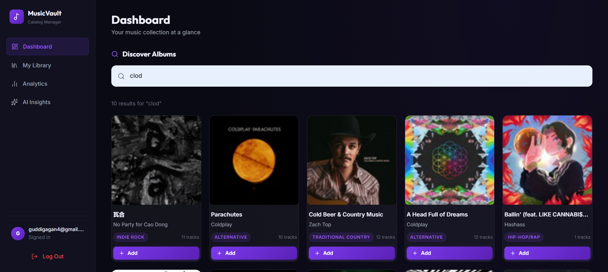
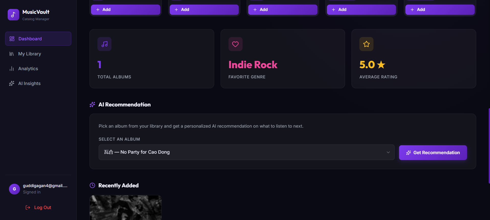
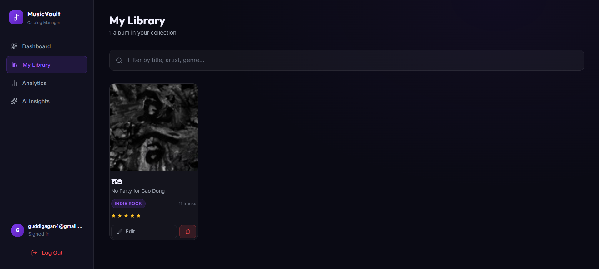
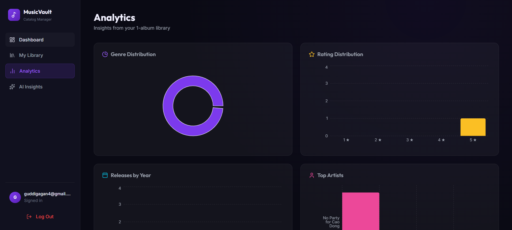
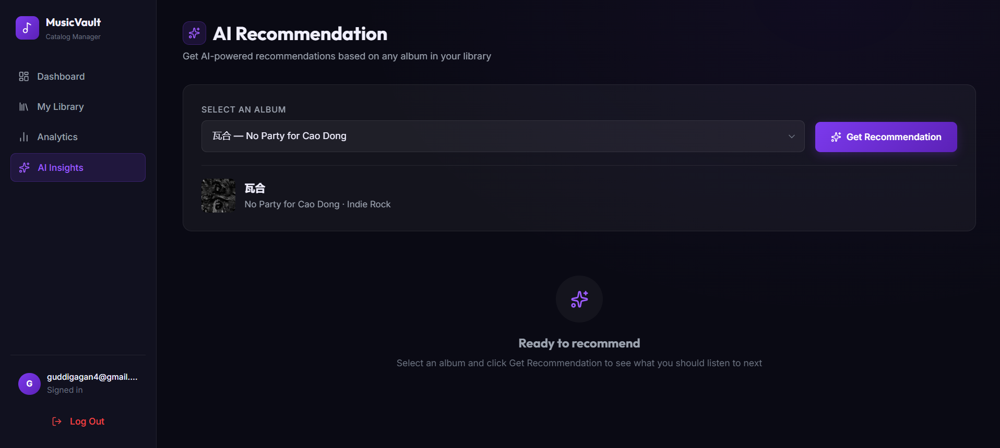

# 🎵 MusicVault – AI-Powered Music Catalog Manager

A full-stack music catalog management platform that lets users search albums through the i​Tunes Search API, build a personal music library, visualize analytics, and generate AI-powered insights.

Developed as part of the Ledger CFO Take-Home Assignment, this project includes a backend, frontend, analytics dashboard, authentication, deployment, and AI feature.

## 🌐 Live demo

- Frontend: https://music-catalog-mu.vercel.app
- Backend API: https://music-catalog-154o.onrender.com
- Repository: https://github.com/gaganguddi/music-catalog
 

## Dashboard





---

## My Library



---

## Analytics



---

## AI Music Recommendations




## 📖 Project overview

MusicVault enables users to discover music with the public i​Tunes Search API and create a personalized music collection.

- 🔐 JWT authentication
- 🔍 Album search
- ❤️ Personal-library album saving
- ✏️ Ratings and notes
- 🗑️ Album deletion
- 📊 Analytics dashboard
- 🤖 AI-powered music insights
- ☁️ Cloud deployment

## 🎯 Assignment focus

**Selected entity: Albums**

Albums provide richer metadata than songs or artists: album title, artist, genre, release date, track count, artwork, and price. This makes the analytics and AI insights more meaningful and visually appealing.

## 🚀 Features

### Authentication

- User registration and login
- JWT authentication
- Protected routes
- Logout

### Album search

- Search albums using the i​Tunes Search API
- Instant results with artwork, genre, release date, and track count

### Personal library

Users can add albums, view saved albums, edit ratings, add personal notes, and delete albums. Library data is stored in MySQL.

### Analytics dashboard

Visualize the personal library with charts for:

- 📊 Albums by genre
- 📈 Albums added over time
- 🍩 Genre distribution
- 📉 Release-year analysis

### AI insights

The Google Gemini API generates a music-collection summary based on saved albums, including common genres, artist trends, collection diversity, and listening recommendations.

## 🛠 Tech stack

| Area | Technologies |
| --- | --- |
| Frontend | React, Vite, React Router, Axios, React Hook Form, Recharts, Tailwind CSS, Lucide React, React Hot Toast |
| Backend | Java 17, Spring Boot, Spring Security, Spring Data JPA, JWT, Hibernate, Maven |
| Database | MySQL (FreeDB) |
| Third-party APIs | i​Tunes Search API, Google Gemini API |

### Why MySQL?

MySQL suits the relational library data model, supports straightforward CRUD operations, integrates well with Spring Data JPA, and is reliable for structured music metadata.

## 🗄 Database schema

### Users

| Field | Type |
| --- | --- |
| id | Long |
| name | String |
| email | String |
| password | String |
| created_at | Timestamp |

### Library

| Field | Type |
| --- | --- |
| id | Long |
| apple_catalog_id | Long |
| title | String |
| artist_name | String |
| genre | String |
| release_date | Date |
| track_count | Integer |
| artwork_url | String |
| user_rating | Integer |
| user_notes | Text |
| created_at | Timestamp |
| updated_at | Timestamp |

The database stores only the user's personal library; album metadata is retrieved from the i​Tunes API.

## 🔐 Authentication flow

```text
Register → Login → JWT generated → Stored in local storage → Protected API requests
```

Protected requests use:

```http
Authorization: Bearer <token>
```

## 📡 REST APIs

| Area | Endpoint |
| --- | --- |
| Authentication | `POST /api/auth/register` |
| Authentication | `POST /api/auth/login` |
| Search | `GET /api/search/albums?term={album}` |
| Library | `GET /api/library` |
| Library | `POST /api/library` |
| Library | `PUT /api/library/{id}` |
| Library | `DELETE /api/library/{id}` |
| AI | `POST /api/ai/insights` |

## 📁 Project structure

```text
music-catalog/
├── music-catalog-backend/
│   └── src/main/java/.../{config,controller,dto,entity,repository,security,service,util}
└── music-catalog-frontend/
    └── src/{api,components,context,hooks,layouts,pages,services,styles}
```

## ⚙️ Local setup

Clone the repository:

```bash
git clone https://github.com/gaganguddi/music-catalog.git
```

### Backend

```bash
cd music-catalog-backend
```

Configure these environment variables:

```env
DB_URL=
DB_USERNAME=
DB_PASSWORD=
JWT_SECRET=
GEMINI_API_KEY=
```

Run the backend:

```bash
mvn spring-boot:run
```

It runs at http://localhost:8080.

### Frontend

```bash
cd music-catalog-frontend
npm install
```

Create `.env`:

```env
VITE_API_URL=http://localhost:8080/api
```

Run the frontend:

```bash
npm run dev
```

It runs at http://localhost:5173.

## 🌍 Deployment

- Frontend: Vercel
- Backend: Render
- Database: FreeDB (MySQL)

## 📈 Future improvements

- Album recommendations based on user preferences
- Pagination and infinite scrolling
- Debounced search
- Unit and integration tests
- User profiles
- CSV/PDF exports
- Playlist generation and favorite albums
- Dark/light theme toggle

## 🔄 Trade-offs

- The i​Tunes Search API is read-only, so album information cannot be modified.
- JWTs are stored in local storage for simplicity; HttpOnly cookies would be preferable in production.
- Analytics only use saved-library data, keeping queries efficient but limiting insights to saved albums.
- Free hosting services can introduce cold starts and resource limits.

## 📋 Assignment checklist

| Requirement | Status |
| --- | --- |
| Java Spring Boot backend | ✅ |
| React frontend | ✅ |
| MySQL database | ✅ |
| JWT authentication | ✅ |
| Search API integration | ✅ |
| Personal library CRUD | ✅ |
| Analytics dashboard | ✅ |
| AI feature | ✅ |
| Responsive UI | ✅ |
| Deployment | ✅ |
| README | ✅ |

## 👨‍💻 Author

Gagan H

- GitHub: https://github.com/gaganguddi
- Portfolio: https://gaganh-portfolio.netlify.app

## Acknowledgements

- Apple i​Tunes Search API
- Google Gemini API
- Spring Boot
- React
- Vercel
- Render
- FreeDB
